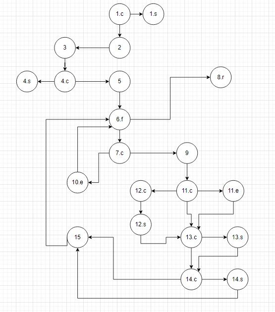
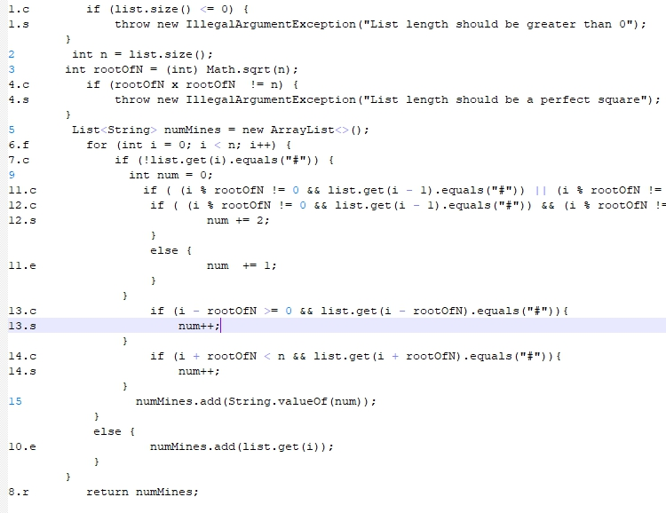
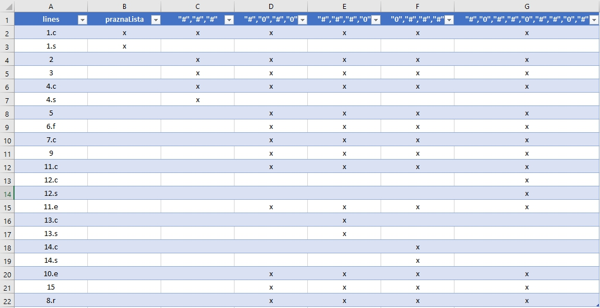
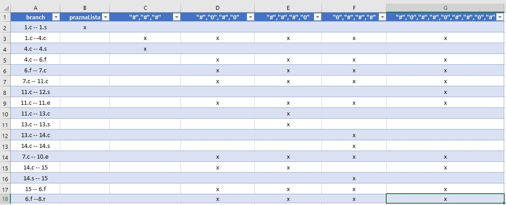

Втора лабораториска вежба по софтверско инженерство
Сашко Станковски 133001

2. Control Flow Graph Diagram

Ознаки од кодот:

3. Цикломатска комплексност

Цикломатската комплексност изнесува 7.

	26 ребра - 21 јазли + 2 = 7
	
4. Every statement тест случаи за тестирање во фајлот everyStatementCases.xlsx

слика everyStatementCases.jpg

Тестовите ги правев во рамки на функцијата public void everyStatementTestovi() 
со споредба на поединечни јазли, од дадена листа и резултантна листа,
со помош на методите assertEquals, 
пример assertEquals( "objekt[3] != 1","1", silab2_objekt.function(lista1).get(3) );
и потоа проверка на валидноста преку принтање на добиената листа.

5. Every branch тест случаи за тестирање во фајлот everyBranchCases.xlsx

слика everyBranchCases.jpg

Тестовите ги правев во рамки на функцијата public void everyBranchTestovi() и 
тие се истите како во everyStatementTestovi() ,со споредба на поединечни јазли, 
од дадена листа и резултантна листа, со помош на методите assertEquals,
и потоа проверка на валидноста преку принтање на добиената листа.

